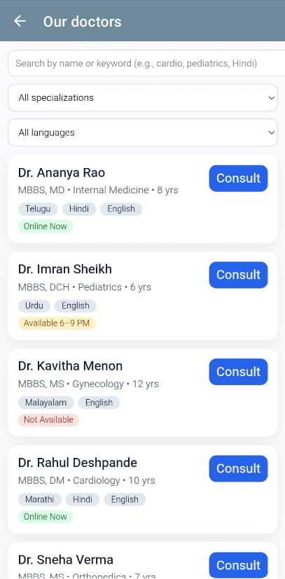
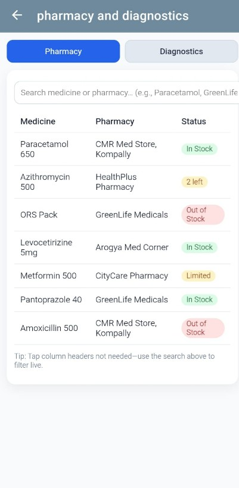
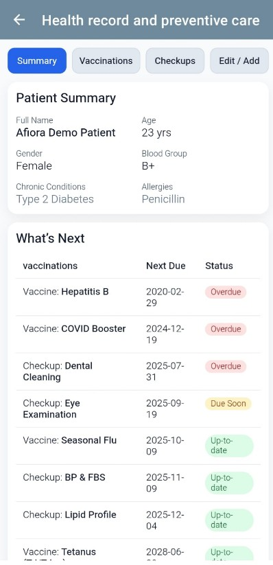

# 📱 Afiora Healthcare App  

Afiora Healthcare is a **prototype healthcare application** designed to make healthcare services more accessible, especially for rural and semi-urban communities.  
This is my **first major GitHub project** after two smaller beginner projects, and it reflects my journey of learning app development while solving real-world healthcare challenges.  

## ✨ Current Features  

- 🏥 **Book Appointment** – Schedule visits with doctors  
- 👨‍⚕️ **Doctors Directory** – Browse and connect with doctors  
- 📂 **My Health Records** – Store and view medical records offline  
- 💊 **Pharmacy Availability** – Check availability of medicines in local pharmacies  
- ❓ **FAQ Section** – Quick answers to common healthcare-related questions  
- 🚨 **Emergency Help** – One-tap emergency support for patients in need  

## 📸 Screenshots  

###app logo
[app logo](afiora.jpg)

### Homepage  
  

### Doctors Directory  
  

### Health Records  
  

### Emergency Help  
  

## 📥 Download APK  

👉 [Download Afiora Healthcare App](https://tinyurl.com/afiora-healthcare)  

  

## 🛠️ Tech Stack (Planned)  

- **Android (Java/Kotlin / Flutter)** – Planned migration for full codebase  
- **Cloud Backend (Firebase / AWS / Azure)** – For real-time data & storage  
- **AI/NLP Models** – For intelligent health queries and chatbot integration  

## 🚀 Future Scope  

- 🔲 Real-time doctor consultation (video & chat)  
- 🔲 AI-powered symptom checker for initial diagnosis support  
- 🔲 Multi-language support (English + regional languages)  
- 🔲 Integration with government health databases (vaccination schedules, outbreak alerts)  
- 🔲 Medicine delivery integration (partner pharmacies for home delivery)  
- 🔲 Wearable device support (fitness trackers, vitals monitoring)  
- 🔲 **Sign Language to English Translator** – Anime-inspired virtual assistant/toy that interprets sign language gestures and translates them into English text/speech to help doctors communicate with patients who cannot speak  

## 📌 Roadmap  

- ✅ Publish APK prototype  
- ✅ Add screenshots & project documentation  
- 🔲 Upload source code (future Android/Flutter migration)  
- 🔲 Add authentication & secure login  
- 🔲 Deploy cloud backend for real-time data  
- 🔲 Build AI chatbot + sign language assistant  
- 🔲 Launch as an open-source healthcare app  

## 👩‍💻 About Me  

I am a **beginner developer** exploring mobile app development, cloud computing, and AI/ML integration.  
This project marks my first step into building **impactful, real-world applications**.  

I already have two other projects on GitHub, and Afiora Healthcare App is my **first end-to-end prototype** that I plan to grow into a scalable digital health ecosystem.  

##  Contribute

Feel free to ⭐ star this project or fork it to add improvements!

**Let’s Connect!**  
I'm sharing this as part of my learning journey—find me on [LinkedIn](www.linkedin.com/in/mehwishafsa)
